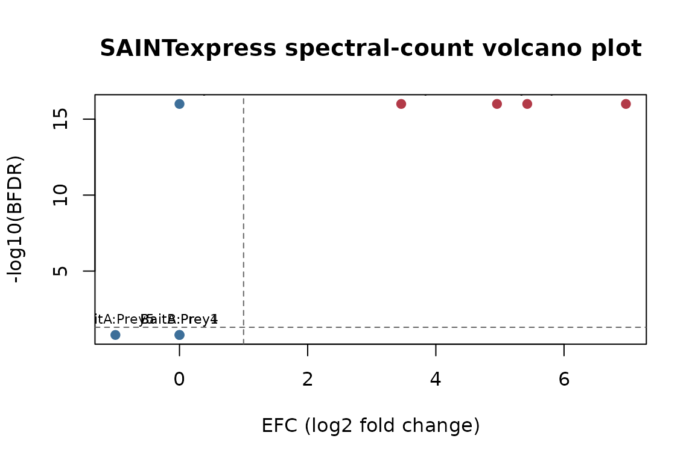
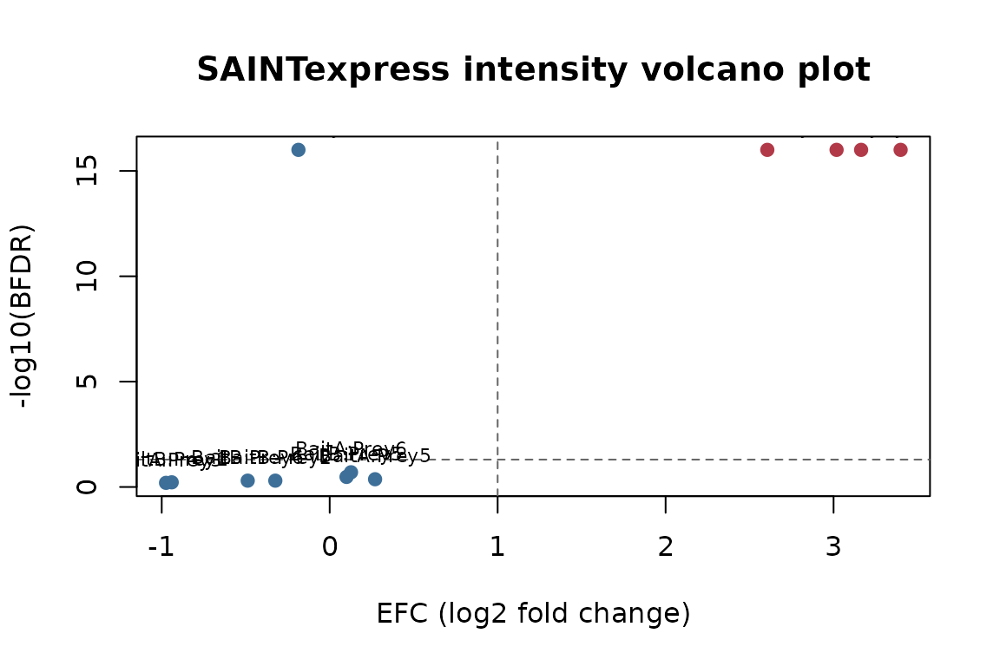

# Scoring simulated SAINT input with the pure-R engine

This vignette walks through scoring a simulated affinity-purification
experiment with
[`saintexpress::run_saint()`](https://prolfqua.github.io/saintexpress/reference/run_saint.md).
No native binary is involved — everything runs in pure R.

## Simulate a small AP-MS experiment

We define two real baits (`BaitA`, `BaitB`) with two replicates each,
plus two controls. Six preys exist; `BaitA` enriches for `Prey1`/`Prey2`
and `BaitB` for `Prey3`/`Prey4`. The remaining preys are background.

``` r
simulate_si <- function(seed = 42, mode = c("spc", "int")) {
  mode <- match.arg(mode)
  set.seed(seed)
  preys  <- paste0("Prey", 1:6)
  baits  <- c("BaitA", "BaitA", "BaitB", "BaitB", "Ctrl1", "Ctrl2")
  ips    <- paste0("IP", seq_along(baits))
  cort   <- c("T", "T", "T", "T", "C", "C")

  # One row per IP x prey; recover the bait for each IP.
  grid <- expand.grid(ipId = ips, preyId = preys, stringsAsFactors = FALSE)
  grid$baitId <- baits[match(grid$ipId, ips)]

  # A prey is enriched ("signal") only for its true bait; everything else is background.
  signal <- (grid$baitId == "BaitA" & grid$preyId %in% c("Prey1", "Prey2")) |
            (grid$baitId == "BaitB" & grid$preyId %in% c("Prey3", "Prey4"))

  # Draw every quantity in one vectorized call.
  if (mode == "spc") {
    lambda <- ifelse(signal, ifelse(grid$baitId == "BaitA", 20, 15), 0.5)
    grid$quant <- stats::rpois(nrow(grid), lambda)
  } else {
    mu <- ifelse(signal, ifelse(grid$baitId == "BaitA", 1e7, 5e6), 1e4)
    grid$quant <- stats::rexp(nrow(grid), 1 / mu)
  }

  inter <- grid[grid$quant > 0, c("ipId", "baitId", "preyId", "quant")]
  rownames(inter) <- NULL
  list(
    inter = inter,
    prey  = data.frame(preyId = preys, preyLength = 500L, preyGeneId = preys,
                       stringsAsFactors = FALSE),
    bait  = data.frame(ipId = ips, baitId = baits, CorT = cort,
                       stringsAsFactors = FALSE)
  )
}

si_spc <- simulate_si(mode = "spc")
str(si_spc, max.level = 2)
#> List of 3
#>  $ inter:'data.frame':   19 obs. of  4 variables:
#>   ..$ ipId  : chr [1:19] "IP1" "IP2" "IP4" "IP6" ...
#>   ..$ baitId: chr [1:19] "BaitA" "BaitA" "BaitB" "Ctrl2" ...
#>   ..$ preyId: chr [1:19] "Prey1" "Prey1" "Prey1" "Prey1" ...
#>   ..$ quant : int [1:19] 26 17 1 1 22 22 2 2 15 10 ...
#>  $ prey :'data.frame':   6 obs. of  3 variables:
#>   ..$ preyId    : chr [1:6] "Prey1" "Prey2" "Prey3" "Prey4" ...
#>   ..$ preyLength: int [1:6] 500 500 500 500 500 500
#>   ..$ preyGeneId: chr [1:6] "Prey1" "Prey2" "Prey3" "Prey4" ...
#>  $ bait :'data.frame':   6 obs. of  3 variables:
#>   ..$ ipId  : chr [1:6] "IP1" "IP2" "IP3" "IP4" ...
#>   ..$ baitId: chr [1:6] "BaitA" "BaitA" "BaitB" "BaitB" ...
#>   ..$ CorT  : chr [1:6] "T" "T" "T" "T" ...
```

## Validate the input tables

``` r
saintexpress::validate_saint_input(si_spc)
```

## Spectral-count scoring

``` r
scores_spc <- saintexpress::run_saint(si_spc, mode = "spc", optimizer = "base")
scores_spc[, c("Bait", "Prey", "AvgP", "BFDR", "SaintScore")]
#>    Bait  Prey AvgP BFDR SaintScore
#> 1 BaitA Prey1 1.00 0.00       1.00
#> 2 BaitB Prey1 0.00 0.16       0.00
#> 3 BaitA Prey2 1.00 0.00       1.00
#> 4 BaitB Prey3 1.00 0.00       1.00
#> 5 BaitA Prey4 0.00 0.16       0.00
#> 6 BaitB Prey4 1.00 0.00       1.00
#> 7 BaitA Prey5 0.00 0.16       0.00
#> 8 BaitB Prey6 0.22 0.00       0.22
```

The true interactors (`Prey1`/`Prey2` for `BaitA`, `Prey3`/`Prey4` for
`BaitB`) should land at the top of each bait by `AvgP`:

``` r
top_per_bait <- function(df) {
  df <- df[order(df$Bait, -df$AvgP), ]
  do.call(rbind, by(df, df$Bait, head, 2))
}
top_per_bait(scores_spc)[, c("Bait", "Prey", "AvgP", "BFDR")]
#>          Bait  Prey AvgP BFDR
#> BaitA.1 BaitA Prey1    1    0
#> BaitA.3 BaitA Prey2    1    0
#> BaitB.4 BaitB Prey3    1    0
#> BaitB.6 BaitB Prey4    1    0
```

## Volcano plot

The `FoldChange` column summarizes enrichment over the estimated
background. We plot it as an effect-size coordinate (`EFC`, here
`log2(FoldChange)`) against the `BFDR` evidence coordinate.

``` r
plot_volcano <- function(scores, title) {
  volcano_data <- scores
  volcano_data$EFC <- log2(volcano_data$FoldChange)
  volcano_data$neg_log10_bfdr <- -log10(pmax(volcano_data$BFDR, 1e-16))
  volcano_data$is_hit <- volcano_data$BFDR <= 0.05 & volcano_data$EFC >= 1

  plot(
    volcano_data$EFC,
    volcano_data$neg_log10_bfdr,
    pch = 19,
    col = ifelse(volcano_data$is_hit, "#B23A48", "#3D6F99"),
    xlab = "EFC (log2 fold change)",
    ylab = "-log10(BFDR)",
    main = title
  )
  abline(h = -log10(0.05), lty = 2, col = "grey40")
  abline(v = 1, lty = 2, col = "grey40")
  text(
    volcano_data$EFC,
    volcano_data$neg_log10_bfdr,
    labels = paste(volcano_data$Bait, volcano_data$Prey, sep = ":"),
    pos = 3,
    cex = 0.7
  )
}

plot_volcano(scores_spc, "SAINTexpress spectral-count volcano plot")
```



## Intensity scoring

The same simulator, with `mode = "int"`, produces continuous abundances.

``` r
si_int <- simulate_si(mode = "int")
scores_int <- saintexpress::run_saint(si_int, mode = "int", optimizer = "base")
top_per_bait(scores_int)[, c("Bait", "Prey", "AvgP", "BFDR")]
#>          Bait  Prey AvgP BFDR
#> BaitA.1 BaitA Prey1    1    0
#> BaitA.3 BaitA Prey2    1    0
#> BaitB.6 BaitB Prey3    1    0
#> BaitB.8 BaitB Prey4    1    0
```

``` r
plot_volcano(scores_int, "SAINTexpress intensity volcano plot")
```



## See also

For running the original native SAINTexpress C++ binary on the same
input, see the companion package
[`saintexpressbin`](https://github.com/prolfqua/saintexpressbin).

## Session information

``` r
sessionInfo()
#> R version 4.6.0 (2026-04-24)
#> Platform: x86_64-pc-linux-gnu
#> Running under: Ubuntu 24.04.4 LTS
#> 
#> Matrix products: default
#> BLAS:   /usr/lib/x86_64-linux-gnu/openblas-pthread/libblas.so.3 
#> LAPACK: /usr/lib/x86_64-linux-gnu/openblas-pthread/libopenblasp-r0.3.26.so;  LAPACK version 3.12.0
#> 
#> locale:
#>  [1] LC_CTYPE=C.UTF-8       LC_NUMERIC=C           LC_TIME=C.UTF-8       
#>  [4] LC_COLLATE=C.UTF-8     LC_MONETARY=C.UTF-8    LC_MESSAGES=C.UTF-8   
#>  [7] LC_PAPER=C.UTF-8       LC_NAME=C              LC_ADDRESS=C          
#> [10] LC_TELEPHONE=C         LC_MEASUREMENT=C.UTF-8 LC_IDENTIFICATION=C   
#> 
#> time zone: UTC
#> tzcode source: system (glibc)
#> 
#> attached base packages:
#> [1] stats     graphics  grDevices utils     datasets  methods   base     
#> 
#> loaded via a namespace (and not attached):
#>  [1] digest_0.6.39      desc_1.4.3         R6_2.6.1           fastmap_1.2.0     
#>  [5] xfun_0.58          saintexpress_0.0.1 cachem_1.1.0       knitr_1.51        
#>  [9] htmltools_0.5.9    rmarkdown_2.31     lifecycle_1.0.5    cli_3.6.6         
#> [13] sass_0.4.10        pkgdown_2.2.0      textshaping_1.0.5  jquerylib_0.1.4   
#> [17] systemfonts_1.3.2  compiler_4.6.0     tools_4.6.0        ragg_1.5.2        
#> [21] evaluate_1.0.5     bslib_0.11.0       yaml_2.3.12        jsonlite_2.0.0    
#> [25] rlang_1.2.0        fs_2.1.0
```
